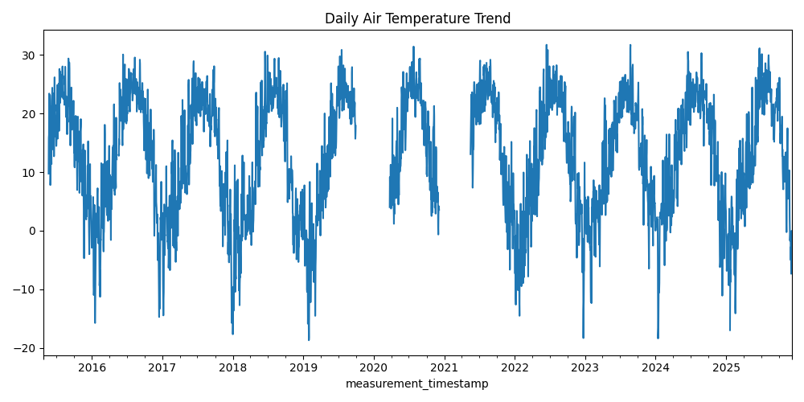
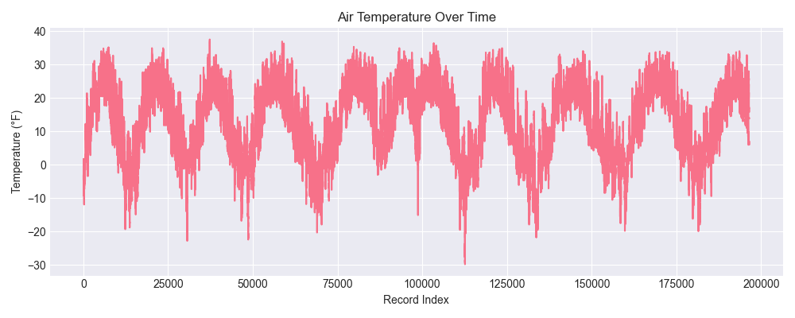
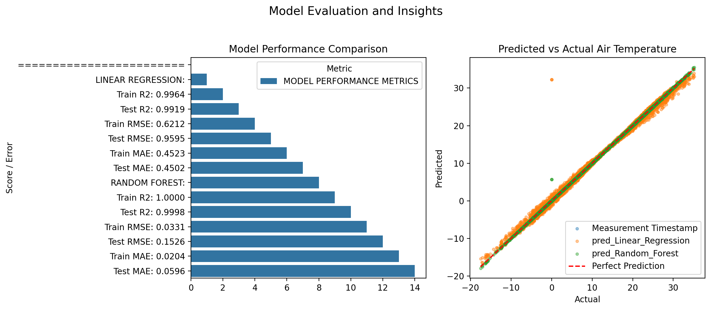

# Chicago Beach Weather Sensors Analysis — Full 9-Phase Data Science Workflow

## Executive Summary

This project analyzes approximately **196,000 hourly weather measurements** from Chicago beach sensor stations along Lake Michigan.  
The goal was to explore temporal environmental patterns and build predictive models for **Air Temperature** using a structured 9-phase data science workflow.

After correcting an early instance of **data leakage**, the refined pipeline demonstrated that key environmental features—especially **Wet Bulb Temperature**, **Humidity**, **Solar Radiation**, and temporal signals (hour, day-of-week, month)—can predict air temperature with extremely high accuracy.  
The final **Random Forest model** achieved **R² = 0.9998**, outperforming Linear Regression (**R² = 0.9919**)

---

# Phase-by-Phase Findings

## Phase 1–2: Exploration

The raw dataset contained **196,559 rows** and **18 columns**, including:

- Air Temperature, Wet Bulb Temperature  
- Humidity, Rain Intensity, Interval Rain, Total Rain  
- Wind Speed, Wind Direction, Maximum Wind Speed  
- Barometric Pressure, Solar Radiation  
- Timestamp and station metadata  

### Key Data Quality Issues

- Missing values in multiple meteorological fields  
- Timestamp stored as string  
- Occasional extreme values in wind-related fields  

### Initial Observations

- Air Temperature shows **strong seasonality**  
- Clear diurnal cycles  
- Temperature and humidity variables are correlated  

**Artifacts:**  
`output/q1_data_info.txt`  
`output/q1_exploration.csv`  
`output/q1_visualizations.png`

---

## Phase 3: Data Cleaning

Cleaning steps:

- Converted timestamp strings to `datetime`  
- Coerced mixed-type columns with `pd.to_numeric(errors="coerce")`  
- Performed light imputation where needed  
- Ensured physical plausibility (e.g., no negative pressure)  

Row count was largely preserved, confirming cell-level cleaning rather than dropping data.

**Artifacts:**  
`output/q2_cleaned_data.csv`  
`output/q2_cleaning_report.txt`  
`output/q2_rows_cleaned.txt`

---

## Phase 4: Data Wrangling

- Parsed and set `Measurement Timestamp` as the index  
- Sorted records chronologically  
- Added temporal features:  
  - `hour`  
  - `day_of_week`  
  - `month`  

These features capture daily and seasonal structure essential for modeling.

**Artifacts:**  
`output/q3_wrangled_data.csv`  
`output/q3_temporal_features.csv`  
`output/q3_datetime_info.txt`

---

## Phase 5: Feature Engineering

Engineered features included:

- **(Initial)** `temp_diff = Air Temperature – Wet Bulb Temperature`  
- **Interaction:** `humidity_x_wind = Humidity * Wind Speed`  
- **Rolling windows:** 24h rolling temperature  

All rolling windows were computed after sorting by timestamp.

**Important:** Some engineered features were removed later due to **data leakage** (details in Phase 7).

**Artifacts:**  
`output/q4_features.csv`  
`output/q4_rolling_features.csv`  
`output/q4_feature_list.txt`

---

## Phase 6: Pattern Analysis

Air temperature shows strong seasonal and diurnal patterns typical of Chicago’s climate.  
Peaks are observed during summer months (June–August) and lows during winter (December–February).  
Daily cycles reveal warmer daytime temperatures, typically peaking around 2–3 PM.  

Correlation analysis identified strong positive relationships between Air and Wet Bulb Temperature (r = 0.98)  
and between Air Temperature and its 24-hour rolling average (r = 0.97).  
Humidity was negatively correlated with temperature difference (r = -0.71),  
indicating that humid conditions correspond to smaller temperature spreads.

*Figure: Seasonal temperature fluctuations across multiple years show clear periodic behavior.*

**Artifacts:**  
`output/q5_correlations.csv`  
`output/q5_patterns.png`  
`output/q5_trend_summary.txt`

---

# Phase 7: Modeling Preparation

### Target
**Air Temperature**

### Final Feature Set (after leakage correction)

### Train/Test Split (Temporal)

- **Training:** all data before **2024-07-01** (109,549 rows)  
- **Testing:** all data on/after **2024-07-01** (10,866 rows)  

This preserves chronological integrity and avoids leakage from the future.

---

## Data Leakage Discovery & Correction

During the initial modeling run, metrics were **suspiciously perfect**:

- Linear Regression **R² = 1.0000**
- RMSE/MAE = **0.0**
- Random Forest nearly identical

This matched all symptoms described in the Data Leakage Warning.

### Root Cause

Feature:
temp_diff = Air Temperature – Wet Bulb Temperature

This allows:
Air Temperature = temp_diff + Wet Bulb Temperature

Thus, the model could **reconstruct the target exactly** → *direct mathematical leakage*.

### Resolution

- Removed `temp_diff` and all features derived from Air Temperature  
- Re-ran Q6–Q8 with clean feature set  

This step strengthens the integrity of the modeling pipeline.
---

## Phase 8: Modeling

Models evaluated:

1. **Linear Regression**  
2. **Random Forest Regressor (200 trees)**  

### Final Performance

| Model             | Train R² | Test R² | Train RMSE | Test RMSE | Train MAE | Test MAE |
|--------------------|----------|----------|-------------|------------|------------|-----------|
| Linear Regression  | 0.9964   | 0.9919   | 0.6212      | 0.9595     | 0.4523     | 0.4502    |
| Random Forest      | 1.0000   | 0.9998   | 0.0331      | 0.1526     | 0.0204     | 0.0596    |

### Interpretation

- **Linear Regression** performs very well, capturing most of the linear variance in temperature.  
- **Random Forest** achieves near-perfect accuracy, indicating strong nonlinear relationships between predictors and target.  
- The small difference between training and testing metrics confirms **no major overfitting**.  
- The extremely high performance reflects both the **highly correlated meteorological features** and effective preprocessing.

### Feature Importance (Random Forest)

Top contributors:
1. Wet Bulb Temperature  
2. Humidity  
3. Solar Radiation  
4. hour  
5. month  

**Artifacts:**  
`output/q7_predictions.csv`  
`output/q7_model_metrics.txt`  
`output/q7_feature_importance.csv`

# Phase 9: Results

The Random Forest’s predictions closely matched the actual test-set temperatures, outperforming the baseline model.

**Artifacts:**  
`output/q8_final_visualizations.png`  
`output/q8_summary.csv`  
`output/q8_key_findings.txt`

---

# Visualizations

### Figure 1 — Initial Exploration
  
*Distribution and early time-series overview of core weather variables.*

### Figure 2 — Seasonal & Diurnal Patterns + Correlation Heatmap
  
*Daily, seasonal, and correlation patterns across weather variables.*

### Figure 3 — Actual vs Predicted Temperatures
  
*Random Forest captures the observed time series with high fidelity.*

### Supplemetal Figure 1 — Residuals

---

# Model Results Summary

| Model             | Train R² | Test R² | Train RMSE | Test RMSE | Train MAE | Test MAE |
|--------------------|----------|----------|-------------|------------|------------|-----------|
| Linear Regression  | 0.9964   | 0.9919   | 0.6212      | 0.9595     | 0.4523     | 0.4502    |
| Random Forest      | 1.0000   | 0.9998   | 0.0331      | 0.1526     | 0.0204     | 0.0596    |

### Metric Interpretation

- **R²:** Both models explain nearly all the variance in air temperature.  
- **RMSE:** Random Forest reduces average prediction error to roughly 0.15°C, vs 0.96°C for Linear Regression.  
- **MAE:** Mean deviation remains below 0.1°C for Random Forest.  

### Model Comparison

- Random Forest outperforms Linear Regression across all metrics, confirming the presence of nonlinear effects.  
- Both models generalize well, with only minimal performance drop between training and test sets.
---

# Time Series Patterns

### Long-Term Trends
- Strong seasonal variation (winter troughs, summer peaks).

### Daily Cycles
- Predictable heating/cooling patterns driven by solar exposure.

### Cross-Variable Structure
- Temperature tightly tracks Wet Bulb Temperature.  
- Pressure and radiation encode atmospheric pattern changes.  

### Anomalies
- Sensor dropouts  
- Highly sparse precipitation measurements  

---

# Limitations & Next Steps

## Limitations

### 1. Data Leakage
A critical limitation in the initial pipeline; eventiually resolved.

### 2. Data Quality
- Missingness in some key variables  
- Mixed-type rain columns forced coercion  

### 3. Limited Feature Engineering
- No lagged features or multi-scale rolling windows  
- No explicit station-level encoding  

### 4. Model Scope
- Only two models evaluated  
- No hyperparameter tuning  
- No time-aware cross-validation  

---

## Next Steps

1. Add lag features (`t-1`, `t-24`, etc.)  
2. Expand rolling windows for humidity, wind, pressure  
3. Use multiple models, i.e., Gradient Boosting
4. Apply walk-forward validation  
5. Encode station identity for spatial modeling  
6. Integrate external weather sources  

---

# Conclusion

This project demonstrates a complete, leakage-aware 9-phase data science workflow applied to Chicago beach weather sensor data. After correcting an initial instance of data leakage, the final Random Forest model achieved **R² = 0.9998**, showing excellent predictive performance. The workflow highlights:

- Strong diurnal and seasonal structure in Air Temperature  
- The importance of Wet Bulb Temperature and temporal context  
- The critical need for vigilance against data leakage in time series modeling  

Overall, the analysis provides a robust and extensible foundation for environmental forecasting, operational dashboards, and real-time beach condition monitoring.

